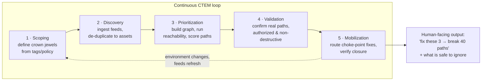
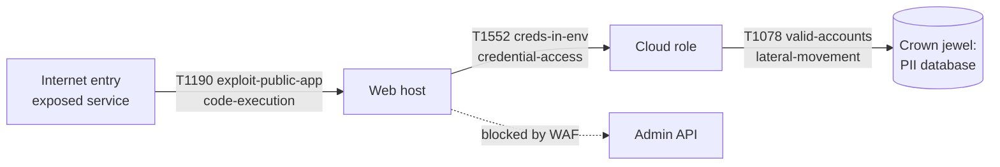
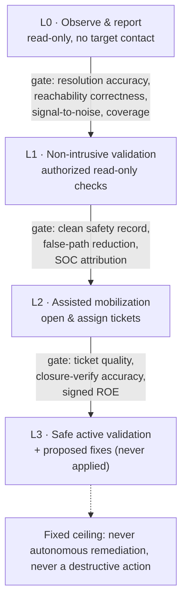
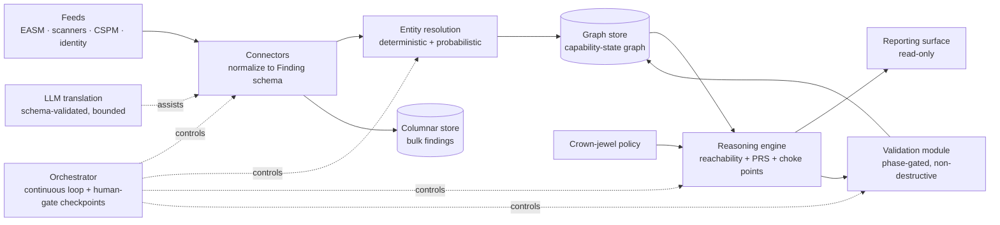

# PLAN — Risk-Based Attack Path Management Agent

> **One sentence:** ingest every external vulnerability and posture signal,
> re-contextualize them as *attack paths* on a capability-state graph, and hand
> a defender the few choke-point fixes that break the most paths to the crown
> jewels — instead of an infinite CVE backlog.

This is the single, consolidated design document for the system. It folds in the
operating model, the architecture, the scoring, the autonomy model and the
decision log. It is organized around the **Gartner CTEM** (Continuous Threat
Exposure Management) lifecycle so a security team can map each component onto a
stage they already run. A separate `BUILD_PLAN.md` is the execution plan for
building it; a self-contained visual walkthrough is `operating-model.html`.

**This is a defensive design.** Its purpose is to reduce a defender's workload
and shrink real risk. It contains no exploit code, payloads, or evasion
techniques, and it assumes the operator owns or is explicitly authorized to
assess every target. The Rules of Engagement (§14) bind every layer.

---

## 1. Operating Model — how it is meant to work

### 1.1 It runs as a continuous loop, not a one-shot scan

The system is an always-on service that cycles through the five CTEM stages and
never really "finishes." Each cycle refreshes the picture and re-ranks the work.



The output a human sees is never a CVE table. It is *"fix these three assets to
break forty paths, seven of them to Tier-0 data,"* plus an explicit count of
findings that are safe to ignore.

### 1.2 The human and the agent have fixed roles

The agent does the tireless, high-volume work — ingesting, de-duplicating,
graph-building, scoring, and (only when earned) non-destructive validation. The
human owns judgment and consequence. The boundary is the **autonomy ladder**
(§12), enforced in the orchestration layer, not merely written in policy.

| The agent does | The human owns |
|---|---|
| Ingest, resolve, build the graph, score, report | Deciding what is a crown jewel (policy) |
| Propose the choke-point list and top paths | Approving any step up the autonomy ladder |
| Non-destructive validation (once at L1+) | Signing Rules of Engagement for active checks |
| Draft a proposed fix (only at L3) | Applying every remediation |

The ceiling never moves: the agent never applies a fix on its own and never
performs a destructive action.

### 1.3 "Build and verify" is the ladder, run in order

The team does not build the whole thing and then test it. They build one phase,
**verify it against that phase's benchmark gate**, and only then build the next.
Two kinds of verification, deliberately different:

- **Verifying the build** — the benchmark exit-criteria in §12. Before trusting
  L0 output, prove entity-resolution accuracy and dead-end-vs-gateway
  correctness. Before L1, prove a clean validation safety record. Each gate is a
  checklist the team signs off before granting more autonomy. The design ships
  the *shape* of each gate; the team sets the actual thresholds.
- **Verification the agent performs** — the CTEM Validation stage (§9). The
  agent confirming a proposed path is real before a human spends time on it, and
  confirming a path is gone after a fix.

Practical rollout: connect the cleanest feed first, run **L0 read-only** on a
small slice of the estate, watch whether the top choke points are genuinely
worth acting on, and expand scope and autonomy only as each gate is met. That
crawl-walk-run sequence is the whole operating philosophy, and it is why a
non-cyber author can hand this over safely — nothing lets the tool get ahead of
the team's confidence in it.

---

## 2. Design principles

1. **Signal-to-noise is the product.** The job is to *reduce* human workload.
   Every feature is judged by whether it helps a defender ignore more noise and
   act on less. A longer list is a failure mode, not a feature.
2. **Paths, not bugs.** The unit of work is an attack path (an ordered chain
   ending at a crown jewel), never an isolated CVE. A "critical" CVE with no
   path to impact is de-prioritized on purpose.
3. **Asset-centric, not scan-centric.** Findings from every tool collapse onto
   a single canonical entity per real-world asset/identity.
4. **Explainable over clever.** Every score and every path is traceable to its
   inputs. No unexplainable black boxes in the prioritization path.
5. **Earned autonomy.** The agent starts read-only. More active behavior is
   unlocked only by meeting benchmark exit-criteria (§12). Nothing destructive,
   ever, without an explicit, human-approved Rule of Engagement.

---

## 3. CTEM lifecycle mapping (the spine)

| CTEM stage | What the agent does | Section |
|---|---|---|
| **Scoping** | Define the crown jewels and the in-scope asset universe from tags/attributes. | §6 |
| **Discovery** | Ingest EASM, vuln scanners, CSPM, identity feeds; de-duplicate into asset-centric entities. | §4 |
| **Prioritization** | Build the capability-state graph, run reachability, compute the Path Risk Score, find choke points. | §5, §7 |
| **Validation** | Confirm a path is real via phased, authorized, non-destructive checks; re-plan around blocked steps. | §9 |
| **Mobilization** | Present "fix these N to break these M paths," route to owners, track closure. | §10 |

---

## 4. Ingestion & De-duplication (CTEM: Discovery)

### 4.1 Feeds

Four feed families are fused. Each is a plug-in *connector* behind a common
interface, so a team turns on only what it has:

| Feed family | Examples | What it contributes to a path |
|---|---|---|
| **EASM** (external attack surface) | external scanners, DNS/TLS/cert inventory, exposed-service discovery | **Entry points** — where an attacker starts, from the internet. |
| **Vulnerability scanners** | Tenable, Qualys, Rapid7 | **CVEs** on hosts/apps — candidate steps and pivots. |
| **CSPM** (cloud posture) | Wiz, Prisma, native AWS/Azure/GCP posture | **Capability edges** — misconfigs, exposed storage, over-broad IAM, public buckets. Often the real hops, not the CVEs. |
| **Identity & access** | IdP / directory, entitlements, service accounts, credential-exposure feeds | **Lateral-movement medium** — trust relationships, role assumption, reused/leaked credentials. |

Each connector normalizes its raw output into a common **Finding** record (§11)
and never writes back to the source.

### 4.2 Asset-centric entity resolution (de-duplication)

Turning many tool-specific findings into **one canonical entity per real
asset/identity** is what moves the team from "CVE-centric lists" to
"asset-centric entities."

1. **Identifier extraction.** From each finding pull every identifier the tool
   provides: cloud resource ID/ARN, instance ID, hostname, FQDN, IP (with
   observation time, because IPs are reused), MAC, cloud tags, container image
   digest, IdP object ID, certificate fingerprint.
2. **Deterministic matching first.** Join on strong keys (cloud resource ID,
   image digest, IdP GUID) — unambiguous, cheap, resolves the large majority.
3. **Probabilistic matching second.** For the remainder, a weighted match over
   softer signals (hostname ↔ IP-at-time ↔ tag set ↔ owner). Auto-merge above a
   high threshold, queue a small "review" band for a human, discard below.
4. **Entity graph, not a table.** Store resolved identities as nodes with a
   `sameAs` relation, so a merge is reversible and auditable — never a
   destructive dedupe.
5. **LLM assist, bounded.** A language model helps only with the *messy*
   translation step — mapping free-text scanner descriptions or unstructured
   asset names to the structured schema and a candidate ATT&CK technique. Its
   output is a *proposal* validated against the schema and a controlled
   vocabulary; it never invents an identifier or a merge. Determinism owns
   identity; the model owns language.

**Conflict vs. missing data.** A field present in two feeds with different
values is a *conflict* (flagged, most-authoritative-source wins, both retained).
A field no feed provides is *missing* (the node carries a confidence penalty
that flows into scoring, so unknowns are visibly unknown, not silently assumed
safe).

### 4.3 Scale

Enterprise scale (hundreds of thousands to millions of tagged assets) drives
three standard choices:

- **Resolution is incremental and streaming**, keyed on strong identifiers, so
  ingest cost is roughly linear in *new/changed* findings, not total assets.
- **The graph is the system of record for relationships;** bulk finding detail
  lives in a columnar store and is joined on demand.
- **Everything is idempotent and re-runnable.** A feed can be replayed without
  double-counting, because entities key on stable identifiers.

---

## 5. Path-Centric Reasoning Engine (CTEM: Prioritization) — the core

### 5.1 The capability-state graph

An edge represents **a capability an attacker would gain**, not merely a network
link.

- **Nodes** — assets (host, service, container, cloud resource), identities
  (user, role, service account), and data stores (crown jewels live here). Each
  node carries its resolved findings, tags, exposure, and value.
- **Edges** — a *capability transition*: "from a foothold on node A, this
  weakness lets an attacker reach node B **with capability C**," where C is one
  of a small controlled set: `initial-access`, `code-execution`,
  `credential-access`, `privilege-escalation`, `lateral-movement`,
  `data-access`. Each edge is labelled with the **MITRE ATT&CK** technique(s)
  it represents and the finding(s) that enable it.

This turns "Vulnerability → Vulnerability" into **"Vulnerability → Capability →
Next Vulnerability"**: a CVE grants a *capability*, and that capability unlocks
the next edge.



> **Note on labels.** The capability names on edges are this design's own
> controlled vocabulary for *what an attacker gains*, and are not the same thing
> as an ATT&CK *tactic*. The `Txxxx` codes are the ATT&CK *technique* that
> enables the edge (e.g. T1078 Valid Accounts), independent of the capability
> label.

### 5.2 Reachability analysis — dead-end vs. gateway

**State model.** An attacker's position is a *state*: `(node, capability-set)`.
An edge is only *usable* if the attacker's current capability-set satisfies the
edge's **precondition**. This is guarded reachability / capability propagation,
closer to planning than to shortest-path.

**Algorithm (multi-source guarded search):**

1. **Sources** = nodes with an `initial-access` capability from an external
   entry point.
2. **Targets** = crown-jewel nodes (§6).
3. Expand from sources; an edge is traversable only when its precondition
   capabilities are already held. Traversing it adds the granted capability to
   the state.
4. Track least-effort predecessors (edge weight = inverse ease; §7) so the
   search yields the **shortest / lowest-effort** path to each crown jewel.
5. A finding whose node is never reached is a **dead-end** — reported and
   dropped from the priority queue, however high its CVSS. A finding on a node
   on any source→crown-jewel path is a **gateway** — kept and scored.

**Why this beats a CVE list:** the same "Critical (9.8)" is a P1 on a short path
to a PII store and a non-issue on an isolated sandbox with no onward capability.
Only the path model can tell those apart.

### 5.3 Choke points

Because paths share nodes, some appear on many paths. A **choke point** is a node
or edge whose removal disconnects the largest number of source→crown-jewel paths.
Two related-but-distinct computations answer this: **min-cut / max-flow** finds
the smallest set whose removal disconnects sources from crown jewels (the true
"break the most paths" set), while **betweenness centrality** ranks how many
shortest paths run through each node (a fast, approximate shortlist). The agent
uses centrality to shortlist and min-cut to confirm. Choke points are the
headline output: *"fix these 3 assets, break 40 paths."*

---

## 6. Criticality & Prioritization (CTEM: Scoping + Prioritization)

### 6.1 Crown Jewels — where pathfinding stops

At enterprise scale you cannot hand-list crown jewels, and you must not let the
search run to infinite paths-to-nowhere. The approach is **attribute-driven
classification with an explicit policy overlay**:

1. **Tag/attribute ingestion.** Pull business-criticality and
   data-classification signals the org already maintains: CMDB criticality
   tiers, cloud resource tags (`data-classification=pii`, `env=prod`,
   `crown-jewel=true`), data-catalog sensitivity labels, IdP group criticality.
2. **A crown-jewel policy** (declarative, version-controlled) maps those
   attributes to a **value tier** (Tier 0 = regulated PII / core identity /
   money movement; Tier 1 = production data; Tier 2 = internal; Tier 3 =
   ephemeral/test). The policy is the single source of truth for "what a path
   must reach to count."
3. **Overlay for exceptions.** An explicit allow/deny list handles assets tags
   get wrong, and is auditable.
4. **Coverage as a first-class metric.** Unclassified assets are surfaced as a
   *blind-spot* — "we cannot tell if this is a crown jewel" is itself a finding.

### 6.2 Presentation to humans

- **"Break the most paths" list** — the ranked choke points: *fix asset X →
  breaks N paths, including P to Tier-0 crown jewels.*
- **Top paths** — highest-scoring individual paths, each a readable chain (entry
  → steps with ATT&CK labels → crown jewel) with the single cheapest severing
  fix.
- **What you can ignore** — an explicit count of dead-end findings, so the team
  can defensibly *not* work them.

---

## 7. Path Risk Score (PRS)

The number that lets a team say *"fix these 3, not those 500."* It ranks paths
(and, derived from them, choke points) above raw CVSS because it accounts for
context CVSS ignores: where the path ends, how easy it is, how short it is, how
exposed its entrance is. **Transparent** (decomposes into named factors),
**tunable** (per-deployment weights), **auditable** (no black box).

### 7.1 Factors (each normalized to `[0,1]`)

| Factor | Symbol | Meaning | Primary source |
|---|---|---|---|
| Asset value | `V` | Value tier of the crown jewel at the endpoint. | Crown-jewel policy (Tier 0–3 → 1.0 / 0.7 / 0.4 / 0.15). |
| Exploitability / ease | `E` | How low-effort the *whole* path is to walk. | EPSS + CISA KEV + effort model, aggregated over edges. |
| Connectivity | `C` | How short the path is and how few alternatives exist. | Graph (length, alternative-route count). |
| Exposure | `X` | How reachable the entry point is. | EASM / externally-exposed findings. |
| Confidence | `κ` | How sure we are the path is real. | Entity/edge confidence + validation status. |

**Edge ease.** A path is only as easy as it is overall, but a single trivial
step matters, so `E` blends the mean and max ease of its edges:

```
edgeEase(e) = w_kev * KEV(e)              # 1.0 if CVE in CISA KEV, else 0
            + w_epss * EPSS(e)            # EPSS probability [0,1]
            + w_effort * (1 - effort(e))  # effort inverted: low effort = high ease
      (sub-weights sum to 1; clamp to [0,1])
E(P) = α * mean(edgeEase) + (1 - α) * max(edgeEase)
```

Default sub-weights `w_kev = 0.35`, `w_epss = 0.25`, `w_effort = 0.40`.
**CVE-less edges** (misconfig / identity hops — a public bucket, a leaked
credential, an over-broad IAM grant): KEV and EPSS are **undefined, not zero**;
treating them as zero would under-rate exactly the low-effort steps that matter
most. So drop the two CVE terms and use `edgeEase(e) = 1 - effort(e)`.

`effort(e)` ordinal model: leaked/valid creds, public bucket, no-auth API `0.05`
· known-exploited public CVE with public exploit `0.2` · misconfig needing
enumeration `0.4` · auth bypass needing chaining `0.6` · complex
memory-corruption / novel exploit `0.9`.

**Connectivity.** `C(P) = β·(1/pathLength) + (1-β)·min(1, altPaths/R)`
(`R ≈ 5`).

### 7.2 The score

```
PRS(P) = 100 * κ(P) * ( wV·V + wE·E + wC·C + wX·X )
```

Weights sum to 1. `κ` scales the whole score down when the path is uncertain, so
an unvalidated path never outranks a confirmed one of equal raw risk; validation
raises `κ`. Defaults: `wV 0.40`, `wE 0.30`, `wX 0.20`, `wC 0.10`, `α 0.5`,
`β 0.6`. Every published ranking records the weights in force, so a change in
order is always attributable to a data change or a deliberate weight change.

### 7.3 Choke-point ranking

Defenders act on assets/edges, not paths, so the headline ranking is by
*remediation leverage*:

```
Leverage(node n) = Σ PRS(P)  for every path P that traverses n
ChokeRank = sort nodes by Leverage desc,
            tie-break by (# Tier-0 paths severed) then (# paths severed)
```

Removing the top node severs every path through it; the agent then recomputes
over the *remaining* graph (a greedy set-cover), so the second recommendation is
the best fix *given the first is done*.

### 7.4 Worked example (illustrative, synthetic)

Three paths to a Tier-0 PII database, all through one web host `W`:

| Path | V | E | X | C | κ | **PRS** |
|---|---|---|---|---|---|---|
| P1: internet → W (KEV RCE) → role → DB | 1.0 | 0.85 | 0.60 | 0.90 | 0.90 | **78** |
| P2: internet → W (KEV RCE) → secret → DB | 1.0 | 0.85 | 0.50 | 0.90 | 0.90 | **76** |
| P3: VPN → W → role → DB | 1.0 | 0.30 | 0.40 | 0.85 | 0.90 | **59** |

`PRS(P1) = 100 · 0.90 · (0.40·1.0 + 0.30·0.85 + 0.20·0.60 + 0.10·0.90) ≈ 78`.
`W` is on all three paths; its leverage is `78 + 76 + 59 = 213`, the highest in
the graph. The agent reports: *"Patch the KEV RCE on web host W — it severs 3
paths to the PII database, 2 internet-reachable. This one fix outranks 500
unrelated CVEs that lead nowhere."* That sentence, not a CVE table, is the
product.

---

## 8. From scores to a decision — one full cycle

Tying §4–§7 together on the running example, the way a single loop iteration
actually reads:

1. **Scoping** marks the PII database Tier 0 from its `data-classification=pii`
   tag, so it is a valid path endpoint.
2. **Discovery** fuses four feeds into four canonical assets: the web host `W`,
   a cloud role, a secret, and the database.
3. **Prioritization** finds three paths to the database, all through `W`, scores
   them (78 / 76 / 59) and computes `W`'s leverage at 213 — the top choke point.
4. **Validation** (once at L1+) confirms `W` runs the flagged version and the
   role is assumable, raising confidence; a WAF-blocked path is re-planned.
5. **Mobilization** emits one sentence — *"Patch `W` → breaks 3 paths to the PII
   database"* — routes it to `W`'s owner, and re-checks after the fix.

The human sees step 5, not the 500 unrelated CVEs the graph proved lead nowhere.
That compression is the whole point; every stage above exists to produce it.

---

## 9. Autonomous Path Verification (CTEM: Validation)

The graph proposes paths from ingested data; some are stale or blocked in
reality. Validation confirms which are real — under strict, phased authority.

**Low-impact validation** is read-only and non-destructive by default, matched
to the current autonomy phase (§12). Examples, all authorized and allow-listed:
does the exposed service actually respond and run the vulnerable version
(banner)? is the bucket actually listable, the misconfig actually present? is
the identity edge actually valid (evaluated *statically* against policy as
written, not by using the credential)? These reduce false paths without
exploiting anything. The agent prefers **inference from already-collected data**
and static policy evaluation over any network interaction.

**Coordinated, not covert (SOC).** A validation program must not drown its own
blue team in alerts, and must not look like a real attack. So all validation
traffic originates from **known, registered scanner identities** on the SOC's
expectation list; it is **rate-limited, business-hours-aware, and logged** to a
shared audit trail; and a **pre-declared window and manifest** tells the SOC what
will run and when. The goal is to be *distinguishable* from a real attacker,
never hidden from defenders.

**Broken paths.** When a check shows a step is blocked (a WAF rejects the entry,
a port is filtered, a patch landed), the agent: (1) marks the edge `blocked` with
expiring evidence and lowers its usability; (2) re-runs reachability to find an
*alternative known* route to the same crown jewel through other edges already in
the graph — ordinary re-planning, not new probing; (3) reports the choke value
of the block itself (a block that severs many paths is a control worth keeping;
one paths route around is providing less protection than it appears). The agent
looks for alternative *known* edges; it does not discover or exploit new
weaknesses to force a path. New-edge discovery is the Discovery layer's job,
through authorized feeds.

---

## 10. Mobilization — closing the loop (CTEM: Mobilization)

- **Ownership routing.** Each choke-point asset carries an owner (from tags /
  CMDB). At higher phases the agent opens and assigns a ticket (Jira/ServiceNow)
  with the path context attached.
- **Remediation stays human.** The highest phase drafts a *proposed* fix
  (e.g. "tighten this IAM policy") for review, and never applies it.
- **Closure verification.** After a fix, the agent re-runs reachability to
  confirm the path is actually broken — "did the fix work" is measured.

---

## 11. Data model

```
Entity        { id, kind: asset|identity|data, canonicalIds[], sameAs[],
                tags{}, valueTier, exposure, owner, confidence }
Finding       { id, entityId, source, type, cve?, cvss?, epss?, kev?,
                observedAt, rawRef }
CapabilityEdge{ id, from, to, capability, attackTechniques[], enabledBy[findingId],
                preconditions[capability], effort, usability, blocked? }
CrownJewel    { entityId, valueTier, reason, policyRuleId }
Path          { id, nodes[], edges[], endpointTier, length, score, status }
```

Findings map to edges (what capability they enable), edges compose into paths,
paths terminate at crown jewels. Everything traces back to a source finding.

---

## 12. Autonomy ladder & roadmap

Autonomy is earned, never granted by default. Each phase defines what the agent
may do, the benchmark exit-criteria to advance, and the human decision required.
The gates are enforced in the orchestration layer, not merely in policy.



| Phase | Agent may… | Agent may NOT… |
|---|---|---|
| **L0** Observe & report | Ingest, resolve, build graph, score, report. Read-only against sources. | Touch any target. Send any outbound probe. Open tickets. |
| **L1** Non-intrusive validation | Also authorized read-only reachability/config checks (service-responds, banner, static IAM eval, bucket-listable), rate-limited, logged, SOC-coordinated. | Exploit, write, chain, or cause any state change. Act outside allow-list/window. |
| **L2** Assisted mobilization | Also open/assign tickets to owners with path context. | Apply any fix. Active validation beyond L1. |
| **L3** Safe active validation + proposed fixes | Also chained non-destructive rate-limited validation under a signed ROE, and *draft* fixes for review. | Merge/apply a fix. Any destructive/DoS action. Exceed the ROE. |

**Benchmark gates (evidence, not time).**
*L0→L1:* entity-resolution accuracy ≥ target (e.g. ≥98% precision, bounded
false-merge rate); reachability dead-end/gateway correctness on a known topology
≥ target; top-10 choke list judged "worth acting on" ≥ target fraction of review
cycles; 100% of scores decompose to source findings; crown-jewel coverage
measured with blind-spots enumerated.
*L1→L2:* N validation cycles with zero out-of-scope actions / state changes /
SOC-confirmed false incidents; validation removes a target fraction of blocked
paths; 100% of validation attributable to the agent's registered identity.
*L2→L3:* target fraction of auto-opened tickets accepted and correctly routed;
closure-verification matches re-test ground truth ≥ target; signed, scoped,
time-boxed ROE with named approvers exists.
The design ships the *shape*; the adopting team sets the numbers.

**Phased backlog** (each item a self-contained build increment; see
`BUILD_PLAN.md` for the execution detail):

- **Phase A — Foundation (→L0):** A1 Finding schema + connector interface ·
  A2 entity-resolution pipeline · A3 graph store + capability-edge model ·
  A4 reachability engine · A5 crown-jewel policy · A6 Path Risk Score +
  choke-point ranking · A7 reporting surface.
- **Phase B — Fusion & scale (still L0):** B1 remaining connectors · B2
  incremental/streaming ingest + columnar store · B3 LLM translation service
  (schema-validated) · B4 continuous loop with L0 checkpoints.
- **Phase C — Non-intrusive validation (→L1):** C1 read-only checks behind
  allow-list/rate-limiter · C2 SOC coordination · C3 broken-path re-planning ·
  C4 confidence uplift into PRS.
- **Phase D — Mobilization (→L2):** D1 ownership routing · D2 ticketing · D3
  closure verification.
- **Phase E — Assisted response (→L3, gated by signed ROE):** E1 chained safe
  active validation · E2 proposed-fix drafting (never auto-applied).

No later phase begins until the prior phase's benchmark gate is met.

---

## 13. Success metrics (the reward function)

Multi-objective — a blended scorecard, not a single number:

| Metric | Optimize | Why |
|---|---|---|
| Choke-point leverage | ↑ paths broken per fix | The headline: fewest fixes, most paths broken. |
| Reachable paths to crown jewels | ↓ over time | The core risk-reduction curve. |
| MTTR on high-PRS paths | ↓ | Proves reduced workload / faster response. |
| Crown-jewel coverage | ↑ (blind-spots ↓) | You cannot protect what you cannot see. |
| Signal-to-noise | ↑ acted-on fraction of top findings | Guardrail: if humans ignore the output, nothing else matters. |

Weighting shifts by phase: **coverage and signal-to-noise dominate early**;
**leverage and MTTR dominate later**.

---

## 14. Rules of Engagement (safety, non-negotiable)

1. **Authorization first.** Only ever assess assets the operator owns or is
   explicitly, documentably authorized to assess. Scope is an allow-list.
2. **Non-destructive by default.** No exploitation, no writes, no DoS, no
   exfiltration. Validation confirms *reachability and configuration*, never
   *impact by causing impact*.
3. **Phase-gated autonomy.** The agent cannot exceed the active phase's allowed
   actions. Promotion requires benchmark exit-criteria and a human decision.
4. **Coordinated, not covert.** Validation runs from registered identities,
   rate-limited, logged, in declared windows.
5. **Human gate before anything active or outbound.** Ticketing, active checks,
   and proposed fixes each require the phase and, where set, per-action
   approval. Remediation is never applied autonomously.
6. **Full audit trail.** Every action, merge, and score is logged and
   explainable.

A design change that would weaken any of these is out of scope without an
explicit, documented decision in §15.

---

## 15. Decision log

Append-only: to change a decision, add a superseding entry, never rewrite.
Origin: three structured interview rounds (2026-09-26).

- **D1 — Purpose: a shareable, vendor-neutral enterprise POC.** For a
  professional cyber team, authored by a non-cyber engineer to show thinking and
  be inserted into the team's flow; monitoring the author's own projects is a
  deployment instance only. Consequence: zero org/personal data, self-contained.
- **D2 — Full framework alignment.** Gartner CTEM + MITRE ATT&CK + EPSS/KEV/CVSS,
  so a cyber team has nothing new to learn.
- **D3 — Capability-state graph.** The only model that distinguishes a dead-end
  "Critical" from a true gateway.
- **D4 — Transparent, tunable Path Risk Score.** Explainability beats a black
  box; teams tune to their appetite.
- **D5 — Four-feed fusion.** Real paths are made of CVEs *and* misconfigs *and*
  identity hops; any one feed alone misses edges.
- **D6 — Attribute-driven crown jewels with a policy overlay.** Hand-listing
  does not scale; without a defined "stop" the search finds infinite paths.
- **D7 — Phase-gated autonomy, not a fixed level.** Earned autonomy with a fixed
  no-autonomous-remediation ceiling.
- **D8 — Blended, phase-weighted success metric.** No single number captures
  reduced workload *and* reduced real risk.
- **D9 — Recommended-but-swappable reference stack.** Prototype fast without
  lock-in; the LLM is scoped narrowly.
- **D10 — Deliverables help, they don't replace the team.** A strong starting
  point, not a finished implementation.
- **D11 — Consolidated into one plan doc + a build plan + a live visual
  (2026-09-26).** The five separate design docs were merged into this file; the
  execution plan lives in `BUILD_PLAN.md`; the visual walkthrough is
  `operating-model.html`. *Why:* the author asked for a single plan document.

**Open questions for the adopting cyber team:** benchmark thresholds; feed
priority (which is cleanest today); weight tuning; the signed Rules of Engagement
for any active validation (L3).

---

## Appendix A — Reference architecture & stack (recommended, swappable)

Each layer names the capability it provides so a team can substitute an
equivalent they run.



| Layer | Capability | Reference | Swap for |
|---|---|---|---|
| Graph store | Capability-state graph + path queries | **Neo4j** (Cypher, GDS for centrality/min-cut) | Memgraph, TigerGraph, Neptune, Postgres+AGE |
| Bulk finding store | Cheap columnar storage | Postgres / warehouse | ClickHouse, BigQuery, Snowflake |
| Orchestration | Agentic loop with human-gate checkpoints | **LangGraph** (state machine, interrupt/approval nodes) | Temporal, plain state machine, Step Functions |
| LLM translation | Scan text → schema + candidate technique | Frontier LLM behind a schema validator (model-agnostic) | Any capable model; keep swappable |
| Connectors | Per-feed normalizers | Thin adapters, one per source | — |
| Presentation | Choke-point + path views | Read-only web UI / report export | Existing GRC or exposure dashboard |

**Why LangGraph:** the workflow needs explicit, human-approvable checkpoints (the
autonomy gates) and durable state across a long-running loop — a graph-of-steps
with interrupt nodes maps directly onto the gates, where autonomy must be
enforceable in code. **Why the LLM is scoped narrowly:** models are excellent at
messy language-to-structure translation and drafting readable path explanations,
and poor as a system of record for identity — so the LLM proposes; deterministic
code with a controlled vocabulary disposes.

---

## Appendix B — Production-ready specification prompt

The design distilled into a single brief an engineer or an AI build agent can
drive development from. Copy the fenced block.

```
Role: You are a Principal Security Architect and AI engineer specializing in
Continuous Threat Exposure Management (CTEM) and autonomous Attack Path
Management (APM).

Mission: Design and build an autonomous, DEFENSIVE agent that solves "CVE
overload." Instead of a list of individual vulnerabilities, the agent ingests
disparate external signals and re-contextualizes them as attack PATHS, so a
resource-constrained team can ignore isolated, unexploitable noise and act only
on the few Critical Paths that reach the organization's Crown Jewels. The agent
exists to REDUCE human workload; a longer output is a failure, not a feature.

Non-negotiable constraints:
- Defensive and authorized only. Assess only assets the operator owns or is
  explicitly authorized to assess (scope is an allow-list).
- Non-destructive by default: no exploitation, writes, DoS, or exfiltration.
- Autonomy is phase-gated and earned against benchmark exit-criteria; the agent
  never applies remediation autonomously and never performs a destructive action.
- Coordinated, not covert: validation runs from registered identities,
  rate-limited, logged, in declared windows, so the SOC can always distinguish
  agent activity from a real attacker.
- Explainable: every score and path decomposes to its source findings.
- Vendor-neutral and free of any real environment's data in the design itself.

Framework alignment: structure the system on the Gartner CTEM lifecycle
(Scoping, Discovery, Prioritization, Validation, Mobilization, run continuously);
label every path step with MITRE ATT&CK technique IDs; score exploitability with
EPSS + CISA KEV + CVSS.

Deliver a technical blueprint and reference implementation for:
1. INGESTION & DE-DUPLICATION (Discovery): pluggable connectors for EASM,
   vulnerability scanners, CSPM, identity; asset-centric entity resolution
   (deterministic then probabilistic, reversible sameAs graph, human review
   band); an LLM assisting only language-to-schema translation behind a strict
   validator; incremental/streaming ingest to millions of assets.
2. PATH-CENTRIC REASONING ENGINE (Prioritization): a capability-state graph
   (nodes = assets/identities/data; edges = a capability gained, ATT&CK-labelled)
   modelling Vulnerability -> Capability -> Next Vulnerability; guarded
   capability-propagation reachability (attacker state = node + capability-set;
   dead-end vs gateway); choke-point analysis (min-cut/betweenness + greedy
   set-cover).
3. CRITICALITY: attribute-driven crown jewels (CMDB/cloud/data-classification
   tags -> value tiers via a version-controlled policy + allow/deny overlay +
   coverage reporting); a transparent tunable Path Risk Score
   = 100 * confidence * (wV*value + wE*ease + wC*connectivity + wX*exposure);
   rank choke points by summed leverage; present as "fix N to break M paths"
   plus an explicit safe-to-ignore count.
4. VALIDATION (phased, authorized, non-destructive): low-impact checks matched to
   the autonomy phase; SOC coordination (registered identities, rate limits,
   declared windows, audit trail); broken-path re-planning over known edges only.
5. ARCHITECTURE (recommended, swappable): graph store (e.g. Neo4j+GDS), columnar
   finding store, orchestration with human-approvable checkpoints (e.g.
   LangGraph) enforcing the autonomy gates in code, a model-agnostic LLM behind a
   schema validator, thin connectors, a read-only presentation surface.
6. AUTONOMY LADDER & METRICS: L0 observe/report -> L1 non-intrusive validation ->
   L2 assisted mobilization -> L3 safe active validation + proposed fixes; each
   promotion requires benchmark exit-criteria plus human sign-off; enforce the
   ceiling in the orchestrator. Optimize a blended scorecard (choke-point
   leverage, reachable paths to crown jewels down, MTTR down, coverage up,
   signal-to-noise up), coverage/signal-to-noise weighted early.

Constraints: prioritize efficiency and signal-to-noise; the agent reduces human
workload; center the transition from Vulnerability Management to Attack Path
Management; provide diagrams, the data model, the scoring formula with defaults,
and the phase-gate criteria.
```
