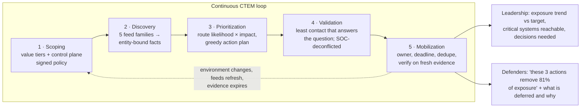
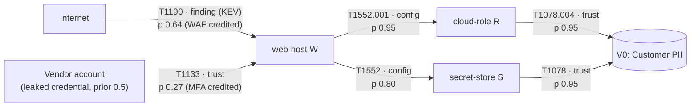
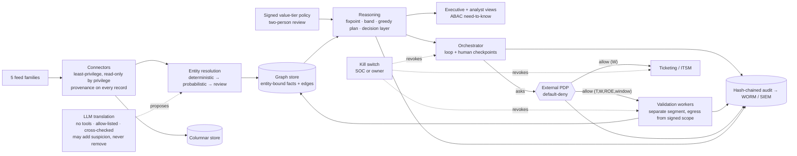

# PLAN — Risk-Based Attack Path Management Agent

> **One sentence:** fuse every exposure signal (vulnerabilities, misconfigurations,
> identity and network trust) into entity-bound attack *routes*, score each route
> by how likely it is to be walked and how much its destination matters, and hand
> defenders the few remediation actions that remove the most risk per unit of
> effort. Show leadership whether that risk is going down.

This is the single design document for the system. It covers:
- the operating model;
- the architecture;
- the scoring;
- the autonomy model;
- platform security;
- governance;
- the decision log.

It is organized around the **Gartner CTEM** (Continuous Threat Exposure Management) lifecycle, so a security team can map each component onto a stage it already runs. `BUILD_PLAN.md` is the execution plan. `operating-model.html` is the mock console. `reference/` holds a runnable engine that computes every number in this document and the console. `tests/` pins those numbers and the "never" claims.

**This is a defensive design.** It contains no exploit code, payloads or evasion techniques. It assumes the operator owns, or is explicitly authorized to assess, every target. The Rules of Engagement (§14) bind every layer.

---

## 0. Revision 2 — what an adversarial review changed, and why

Revision 1 was reviewed by a five-role panel:
- adversary emulation;
- risk quantification;
- AI and platform security;
- SOC and delivery;
- CISO and governance.

The panel was asked to attack the design for novice decisions. Every change below cites its evidence. Where the evidence is arithmetic, it is executed in `tests/engine.test.mjs`. Superseded decisions are recorded in §15 (D12–D24). None is rewritten.

| # | Revision-1 flaw | Evidence | Change | Where |
|---|---|---|---|---|
| 1 | **The worked example could not come out of its own formulas.** | With β = 0.6 the connectivity term tops out at `0.6·(1/3) + 0.4 = 0.60` for a 3-edge path, yet the example used C = 0.90. P3 shares a 0.95-ease edge with P1, so its E ≥ 0.475, yet the example used 0.30. The console's choke table listed W, R and S as breaking "3 + 2 + 1" paths that were the same three paths. | Every number is now computed by `reference/engine.mjs` and asserted by a test. The console's data block is generated, and a test fails if it drifts. | §7.4, App. C |
| 2 | **Path ease used `max(edgeEase)`**, so the easiest step governed. | A route with steps [0.95, 0.10, 0.10] scored E = 0.67, above a single 0.60 step. Its real joint likelihood is ≈ 0.01. | Route likelihood is the **product** of step likelihoods, so the hardest step governs. | §7.1 |
| 3 | **Additive score with a 40-point floor.** | Tier alone gave an *impossible* Tier-0 path 40/100. A trivial Tier-3 test box scored 66 and outranked a hard Tier-0 path at 49. | Multiplicative **likelihood × impact** (NIST SP 800-30 shape) on order-of-magnitude impact weights. An impossible route scores 0. | §7.2 |
| 4 | **Confidence (κ) multiplied the score**, so unknowns ranked lower. That silently assumed safety and contradicted "unknowns visibly unknown". | Attackers pick what defenders cannot see. | Unknowns widen a **[optimistic, pessimistic] band**. Ranking uses the pessimistic end. Band width feeds a *validate-next* queue. | §7.3, §9 |
| 5 | **Global capability set.** Holding `credential-access` anywhere satisfied every edge that needed it. | This produces false paths and misses multi-foothold paths. Standard practice is parametrized facts (MulVAL, Ou et al. 2005) under the monotonicity assumption (Ammann et al. 2002). | **Entity-bound facts** (`hasCred(role-r)`, `execCode(web-w, service)`) and a monotonic fixpoint. | §5.1–5.2 |
| 6 | **Choke point = a node, fix = a finding.** "Patch W's RCE → severs 3 paths" was false: P3 entered W another way. | Leverage 213 counted a path the patch does not cut. | The unit is a **remediation action** that removes specific edges. Its value is ΔR, recomputed greedily on the residual graph. In the worked example the RCE patch **severs nothing on its own**. | §5.3, §7.5 |
| 7 | **Σ-PRS leverage** needed full path enumeration and double-counted near-duplicate paths. | Counting s–t simple paths is #P-hard (Valiant 1979). Ten layers of five alternatives already give ≈ 9.8 M paths. | Risk per jewel uses the **most-likely route** (a max-product fixpoint; no enumeration). Choke value is **ΔR per unit cost**. | §7.3–7.5 |
| 8 | **Only internet entry points.** | Phishing (T1566) and valid accounts (T1078) are perennial top initial-access vectors (Verizon DBIR). Trusted relationships (T1199) and OAuth consent (T1528) are missed entirely. | **Assumed-breach sources** with tunable priors: phished endpoint, leaked credential, third party, SaaS/OAuth, insider. | §5.2 |
| 9 | **Every edge needed a finding.** | Most real lateral movement is intended configuration: sessions, admin rights, role trust (BloodHound's edge set). There was no network-reachability feed at all. | Edge classes `finding / config / trust / netReach`. A **fifth feed family** covers network and segmentation policy. | §4.1, §5.1 |
| 10 | **"Safe to ignore."** | A dead-end is only a dead-end under the graph you can see. An auditor reads "ignored a Critical" as a control failure. Mandated clocks run regardless: PCI DSS v4.0 6.3.3; CISA BOD 22-01 for known-exploited (KEV) vulnerabilities. | Four statuses instead: **on-route**, **floor** (KEV / control plane / compliance scope, clock runs), **deferred-covered**, **deferred-unproven**. Only covered deferrals are deferrable. A feed going dark can never create one (tested). | §6.2 |
| 11 | **"Tier 0" meant data value.** | In Microsoft's Enterprise Access Model, Tier 0 means the *identity control plane*. Tags rarely mark a CI runner as a crown jewel. | Value tiers are renamed **V0–V3**. **Control-plane** assets (IdP, CI/CD, backup, cloud org admin, secrets vault) are critical by policy, not by tag. | §6.1 |
| 12 | **Compensating controls existed only as a binary "blocked" at validation time.** | MFA and WAF reduce likelihood; they do not remove it (T1539, T1621). | Controls carry `coverage` and `bypass` factors. Stale control evidence is not credited under the pessimistic view. | §7.1 |
| 13 | **EPSS, KEV and CVSS misused.** | EPSS is a per-CVE 30-day probability of exploitation *anywhere* (FIRST), not path ease. KEV is correlated with EPSS, so adding both double-counts. CVSS was claimed in the framing but absent from the formula. | One **threat** term (KEV/attacked → 1.0, PoC → 0.6, else EPSS percentile). CVSS v4 base *vector components* feed preconditions. The CVSS base *score* is excluded on purpose. | §7.1 |
| 14 | **The agent enforced its own autonomy.** A kill switch existed only at L3. There was no demotion. | NIST SP 800-207 separates the policy decision point from policy enforcement. Also NIST 800-53 AC-3, AC-4, SC-7. | An **external default-deny PDP**, credentials per rung, and network egress locks. A kill switch at every level. **Automatic demotion.** | §12 |
| 15 | **One ladder mixed two risks.** Target-touching L1 came before ticketing L2, which never touches a target. | NIST SP 800-115 separates passive review from active testing. | **Two axes:** target interaction T0–T4 and workflow write W0–W3, earned separately. | §12 |
| 16 | **Gates had no numbers.** | "The team sets the numbers" becomes "we felt good". | **Default thresholds** with sample sizes and Wilson/rule-of-three bounds. A team may tighten them, never loosen them without a §15 entry. | §12.3 |
| 17 | **The platform itself was unprotected.** Its graph is an attacker's map to every crown jewel, and it holds estate-wide read credentials. | OWASP LLM01:2025; MITRE ATLAS AML.T0051; NIST 800-53 AC-6, AU-9, CM-5, SI-7. | **§14.2 Platform security.** The platform is itself a critical system, and its controls are a precondition for L0 on real data. | §14.2 |
| 18 | **Feed text flowed into an LLM with only a schema check.** | Attacker-controlled banners, certificate CNs and tags can steer a *valid but wrong* technique mapping, which hides a path. | **Asymmetric trust.** The LLM may add suspicion, never remove it. Deterministic cross-checks override it. The LLM has no tools and no graph context. | §4.2, §14.2 |
| 19 | **SOC coordination tended to become suppression.** | Standing scanner allow-lists teach the SOC nothing, and attackers abuse them. | **Deconflicted, not suppressed.** Detections fire and are auto-closed by run ID. Every validated step records whether it was detected: detection coverage becomes an output. | §9 |
| 20 | **No business case, RACI, exception workflow, SLAs, or executive view.** | NIST CSF 2.0 GOVERN (GV.RR, GV.OV); ISO/IEC 27001:2022 6.1.3 (risk owners accept residual risk); SEC Reg S-K Item 106. | §1.4 (build vs buy), §10 (SLAs, exceptions, RACI), §13 (executive KPIs and baseline), and an **Executive** view in the console. | §1, §10, §13 |

---

## 1. Operating model — how it is meant to work

### 1.1 A continuous loop, not a one-shot scan



Nobody gets a CVE table. Defenders get a short, ordered action plan. Leadership gets a trend, the number of critical systems an attacker could reach, overdue fixes, and the decisions only they can make.

### 1.2 Fixed roles — RACI

The agent does the high-volume work. People own judgment and consequence. The boundary is enforced **outside** the agent (§12.2).

| Activity | Accountable | Responsible | Consulted | Informed |
|---|---|---|---|---|
| Value-tier policy (what is critical) | Business service owners / CRO | Security architecture | Data governance | Risk committee |
| Autonomy promotion (either axis) | CISO | APM lead | SOC, Legal/Privacy | Risk committee |
| Fix execution | IT Ops director | Asset-owner team | APM lead | CISO |
| Risk acceptance, V0 / control plane | C-level business owner | Security risk manager | Compliance | Audit committee |
| Risk acceptance, V1–V3 | VP business owner | Security risk manager | Compliance | CISO |
| Score-weight or policy change | CISO | APM lead (two-person review) | Internal audit | — |
| Kill switch | SOC lead **or** service owner | On-call | — | CISO |

The ceiling never moves. The agent never applies a fix, never performs a destructive action, never uses a gained foothold, and never reads business data.

### 1.3 "Build and verify" is the ladder, run in order

The team builds one level, verifies it against that level's **numeric** gate (§12.3), and only then builds the next. There are two kinds of verification:
- **Verifying the build.** The gates cover resolution accuracy, dead-end correctness, top-10 acceptance and safety record. Before any of those, the **platform security** checks (§14.2) must pass, before real data ever arrives.
- **Verification the agent performs.** This is the CTEM Validation stage (§9): confirming a route before a human spends time on it, and confirming closure on *fresh positive evidence* after a fix.

**Rollout.** First measure a four-week **baseline** of the current process (§13.2). Then run L0 in **shadow mode** for 6–8 weeks alongside the existing vulnerability process: existing deadlines stay in force, and the agent's top-10 is compared against what the team actually worked on. Publish precision openly ("8 of 10 accepted"). Expand scope and autonomy only as each gate is met.

### 1.4 Build, buy, or buy-and-extend

This is an established market. Commercial exposure-assessment platforms, adversarial exposure-validation products and identity attack-path tools already do much of §4–§9, and analyst firms evaluate them as product categories. An audit committee will fairly ask why custom software is being built for a commodity capability. The recommended position is **buy-and-extend**:
- Use this document as a **vendor-neutral evaluation rubric**. Score candidates on the §0 flaws, which several shipping products still have, plus 3-year total cost, time to value, connector coverage, identity-path depth, validation safety and exit cost.
- **Build only what products lack.** Usually that is the business-owned value-tier policy, the governance and executive reporting layer, and the demotion and enforcement controls.
- Build the whole platform only if no product clears the rubric. See D19.

Indicative cost of a full build, to be validated: 3–5 engineers for about 12 months to reach W2/T2, plus graph-store licensing and 1–2 FTE to operate it (`BUILD_PLAN.md` §8).

---

## 2. Design principles

1. **Signal-to-noise is the product.** A longer list is a failure mode. But the list gets shorter by *proving* things irrelevant, never by being unable to see them.
2. **Routes, not bugs.** The unit of analysis is a route to something that matters. The unit of *work* is a remediation action.
3. **Asset-centric, entity-bound.** Findings collapse onto canonical entities. Attacker progress is a set of facts about specific entities, never a global capability label.
4. **Explainable over clever.** Every score decomposes into named inputs with provenance (source, fetch time, payload hash).
5. **Fail closed on uncertainty.** Unknown, stale or missing evidence raises the pessimistic score and widens the band. It never lowers priority and never creates a deferral.
6. **Asymmetric trust.** Evidence that *removes or downgrades* a route (dead-end, blocked, lower tier) needs stronger provenance and corroboration than evidence that adds one.
7. **Earned, reversible autonomy.** Two axes, numeric gates, automatic demotion, and enforcement outside the agent.
8. **The platform is a critical system.** Its graph, policy, credentials and logs are protected as the highest tier (§14.2).

---

## 3. Framework mapping

| CTEM stage | What the agent does | Section |
|---|---|---|
| **Scoping** | Value tiers (V0–V3) from a signed policy; control plane critical by default; coverage measured. | §6 |
| **Discovery** | Five feed families → entity resolution → entity-bound facts and edges, with provenance and freshness. | §4 |
| **Prioritization** | Route likelihood × impact; pessimistic ranking; greedy action plan; decision layer and deadlines. | §5, §7 |
| **Validation** | Least-contact confirmation, graded by the target-interaction axis; SOC-deconflicted; detection coverage as an output. | §9 |
| **Mobilization** | Owner routing, deadlines, dedupe, exceptions with expiry, closure on fresh evidence. | §10 |

**Frameworks leadership reports against:**

| Framework | Where this design serves it |
|---|---|
| NIST CSF 2.0 | GV.OV / GV.RR (§1.2 RACI, §13 reporting), ID.RA (§5–§7), ID.IM (§13 metrics loop), PR.PS (§14.2) |
| ISO/IEC 27001:2022 | 6.1.3 risk treatment and owner acceptance (§10.3); Annex A 8.8 technical vulnerability management (§6.2, §10) |
| NIST SP 800-30 | Likelihood × impact risk determination (§7) |
| SEC Reg S-K Item 106 | "Processes for assessing, identifying and managing material risks" (§1, §13), and management's role in them (§1.2) |
| CISA SSVC | Human decision layer: Act / Attend / Track* / Track (§7.6) |
| MITRE ATT&CK | Technique label on every edge (§5.1) |

---

## 4. Ingestion and de-duplication (CTEM: Discovery)

### 4.1 Five feed families

Each connector sits behind a common interface. A team turns on only what it has, and **coverage (§6.1) shows what is missing.**

| Feed family | Examples | Contributes |
|---|---|---|
| **EASM** | DNS/TLS/cert inventory, exposed-service discovery | Internet **sources** and entry edges |
| **Vulnerability scanners** | Authenticated host and app scanning | `finding` edges (CVE-enabled steps) |
| **CSPM** | Cloud posture, IaC scanning | `config` edges: public storage, over-broad IAM, credentials in environments |
| **Identity & access** | IdP/directory, entitlements, sessions, OAuth grants, leaked-credential feeds | `trust` edges and assumed-breach **sources** |
| **Network & segmentation** *(new)* | Firewall, security group, route tables, ZTNA policy | `netReach` edges: can A even talk to B? |

Connectors are **read-only by privilege, not just by behaviour** (§14.2). Every finding carries provenance: `connector@version`, `fetchedAt`, `sha256(raw)`.

### 4.2 Entity resolution

1. **Identifier extraction.** Collect cloud resource IDs, instance IDs, hostnames and FQDNs, IP addresses *with observation time*, image digests, IdP object IDs and certificate fingerprints.
2. **Deterministic matching first** on strong keys.
3. **Probabilistic matching second**, over soft signals, with a human review band.
4. **A reversible `sameAs` graph**, never a destructive dedupe.
5. **Bounded LLM assist.** The LLM translates free-text scanner output into the schema and proposes a candidate ATT&CK technique. All feed text is **untrusted data**: banners, certificate CNs, DNS TXT records, tags and plugin output are attacker-influenceable. Accordingly:
   - The translation model has **no tools, no network and no graph context**.
   - Its output is structured and allow-listed, then **cross-checked deterministically**: CVE → CWE → capability tables, with KEV and EPSS taking precedence.
   - LLM-only edges carry a confidence cap.
   - A second prompt or model samples for disagreement.
   - **The LLM may add suspicion, never remove it.** Any LLM-derived change that turns a gateway into a dead-end goes to human review.

**Conflict vs. missing vs. stale.**
- *Conflict:* feeds disagree. The most authoritative source wins, and both values are retained.
- *Missing:* no feed has the field. The unknown is imputed pessimistically for ranking (§7.3).
- *Stale:* evidence is older than its source's time-to-live. It reverts to *unknown* and is never read as "fine".

Default TTLs:

| Source | TTL |
|---|---|
| Cloud and identity | 1 day |
| EASM | 7 days |
| Vulnerability scan | 14 days |
| Control evidence | 90 days |
| EPSS and KEV | Re-pulled daily |

**Feed health.** If asset or finding volume from a source drops by more than 30% in a cycle, the system raises an alert and **freezes all new deferrals** until the feed recovers (§12.4).

### 4.3 Scale

Resolution is incremental and keyed on strong identifiers. The graph is the system of record for relationships; bulk finding detail lives in a columnar store. Everything is idempotent.

Targets (validated in `BUILD_PLAN.md` M1):

| Measure | Target |
|---|---|
| Entities | 1 M |
| Edges | 10 M |
| Full cycle | ≤ 4 h |
| Incremental update | ≤ 15 min |
| Route query p95 | ≤ 5 s |

---

## 5. Route-centric reasoning (CTEM: Prioritization) — the core

### 5.1 Entity-bound facts and edges

An attacker's progress is a set of **facts about specific entities**, not a global bag of capabilities:

```
execCode(host, privLevel)   hasCred(principal)   assumeRole(role)
netAccess(host, proto, port)   session(idp, role)   dataRead(store)
```

An **edge** says: holding a foothold on `from` (plus any `requires` facts) lets an attacker gain a fact on `to`. Each edge carries:
- an ATT&CK technique;
- a **class**: `finding` (a CVE), `config` (a misconfiguration), `trust` (intended access, such as role trust, a session or an OAuth grant) or `netReach` (network reachability);
- its `enabledBy` findings, if any;
- an effort level;
- any compensating **controls**.

Because facts name their entity, a credential exposed on `web-w` for `role-r` does **not** unlock an edge that needs `role-b`. This is tested ("facts are entity-bound").



### 5.2 Sources and reachability

**Sources** are where an attacker is assumed to start. Each has a tunable **prior**: the probability the attacker already holds that position.

| Vector | Default prior | Why |
|---|---|---|
| `internet` | 1.0 | Anyone can reach an exposed service |
| `leaked-cred` | 0.5 | Credential seen in a paste or breach corpus, not yet rotated |
| `phish-endpoint` | 0.3 | Assume some user endpoint falls to phishing each quarter |
| `third-party` | 0.2 | Vendor or MSP access (T1199) |
| `saas-oauth` | 0.2 | A consented third-party app (T1528) |
| `insider` | set by policy | Scoped explicitly, never default-on |

**Algorithm.** A monotonic max-product fixpoint:
1. Start each source's entity at its prior.
2. Repeatedly relax edges: `L(to) = max(L(to), L(from) · p(e) · Π L(required facts))`.
3. Stop when nothing improves.

Because facts are never lost (the monotonicity assumption), this terminates in at most |E| rounds with no path enumeration. It also yields the **most-likely route** to every entity, which is what gets explained.

For conjunctive (AND) preconditions, `requires` multiplies in each required fact's likelihood, an independence approximation. A Bayesian attack graph (Poolsappasit et al., 2012) is the upgrade path if the team needs calibrated joint probabilities.

### 5.3 Choke points are actions, not nodes

Defenders act by *doing something*, and a patch, a rotation or a segmentation rule removes specific edges. So the ranked unit is a **remediation action**: `{id, label, removesEdges[], cost, owner}`.

Its value is ΔR, the drop in total risk when those edges go (§7.5), recomputed greedily on the residual graph. Two structural checks complement it:
- **Dominators** (Lengauer–Tarjan) per jewel find single points of failure: an entity every route passes through, such as W in the worked example.
- A **minimum-cost cut** from a super-source to a jewel confirms the cheapest set of actions that severs it. On OR-graphs this is max-flow. On AND/OR graphs it is NP-hard (Sheyner et al., 2002), so the greedy plan is used and labelled as such.

Betweenness centrality is only an optional shortlist heuristic. It counts shortest paths only, so it gives zero credit to a node on the second-easiest route.

---

## 6. Criticality and presentation (CTEM: Scoping)

### 6.1 Value tiers and the control plane

A **signed, version-controlled policy** maps attributes to value tiers:

| Tier | Meaning | Impact weight |
|---|---|---|
| **V0** | Regulated personal data, money movement, core business records | 1.0 |
| **V1** | Production data and services | 0.3 |
| **V2** | Internal | 0.1 |
| **V3** | Ephemeral / test | 0.01 |

Weights are spaced by **order of magnitude** because loss magnitudes are (FAIR). They are named V0–V3 to avoid colliding with the Enterprise Access Model's "Tier 0".

**Control plane** (`controlPlane: true`): IdP and directory, CI/CD runners and deploy keys, cloud organization and management accounts, secrets vaults, backup, EDR/MDM consoles and virtualization managers. These are **critical by policy, not by tag**, because compromising them compromises everything they manage. Value is transitive: `V(n) = max(V_own(n), V(m) for every m that n administers)`.

**Tier ratchet.** Tags can raise a tier automatically. Lowering one needs the business owner's confirmation, and every downgrade is logged as a finding: a re-tag from `prod` to `test` is a classic way to hide something.

**Coverage** is a first-class metric: the share of in-scope entities that are **tiered and have fresh evidence**. Unclassified systems are *blind spots*, scored pessimistically. A candidate jewel counts as V1 until classified.

### 6.2 Findings are never "safe to ignore"

Every finding gets exactly one status:

| Status | Rule | What happens |
|---|---|---|
| **on-route** | It enables an edge on a route that reaches a jewel | Worked through its action |
| **floor** | Off-route, but it is KEV, sits on the control plane, or is in compliance scope (e.g. PCI DSS) | Its mandated clock runs regardless of the route analysis |
| **deferred-covered** | Off-route, and the asset and its 1-hop neighbours have fresh evidence | Deferred with an owner and a weekly re-check. Wording: *"Deferred — no route to a critical system under current visibility"* |
| **deferred-unproven** | Off-route only because we cannot see enough | **Not deferrable.** Reported as a visibility gap |

A feed going dark moves findings *out of* deferred-covered, never in. This is tested. Classification is per **finding**, not per node: a local-only DoS CVE on an on-route host enables no edge, so it is not on-route.

### 6.3 What each audience sees

- **Leadership** (console *Executive* view):
  - a one-sentence posture;
  - critical systems reachable (x of y) with a trend;
  - the exposure score against its target glide path;
  - what the next fixes buy;
  - deadline health, including compliance clocks and expiring risk acceptances;
  - exposure by business service;
  - where the team's effort goes;
  - decisions needed, each with an owner, a date and evidence.

  No analyst jargon appears on this view (tested).
- **Defenders** (console *Analyst* view): the greedy action plan with ΔR, ΔR per unit effort, value alone vs. in plan, and decision and deadline; the top routes with per-step likelihoods, the hardest step and the band; findings by status; the validate-next queue.

---

## 7. Scoring

### 7.1 Step likelihood p(e)

```
p(e) = threat(e) · (1 − effort(e)) · Π_controls (1 − coverage · (1 − bypass))

threat(e) = 1.0   if class ≠ finding  (a config/trust/network edge needs no exploit)
          = 1.0   if KEV, or CVSS v4 E:Attacked
          = 0.6   if public proof-of-concept (E:POC)
          = max(0.1, EPSS percentile)  otherwise
```

- **effort** is an ordinal level, with a `null` default meaning unknown (§7.3):

| Effort | Typical step |
|---|---|
| 0.05 | Valid or leaked credential, public bucket, no-auth API |
| 0.2 | Known-exploited CVE with a public exploit, credential in an environment file |
| 0.4 | Misconfiguration needing enumeration, a network hop through segmentation |
| 0.6 | Authentication bypass needing chaining |
| 0.9 | Novel or complex exploit |

- **EPSS** is used as a *threat* prior, not as ease. It is a 30-day, internet-wide signal. Its percentile is used because the raw score is heavily skewed.
- **CVSS v4.** The base *vector* components (AV, AT, PR, UI) set `effort` and preconditions, and the impact components set the granted fact. The CVSS base *score* is deliberately **not** in the formula, because severity is not risk.
- **Controls.** For example, a WAF credited at coverage 0.5 and bypass 0.6 multiplies p by 0.8; phishing-resistant MFA at coverage 0.9 and bypass 0.2 multiplies it by 0.28. Control evidence older than its TTL is **not credited under the pessimistic view**, which pushes a check up the validate-next queue.

### 7.2 Route likelihood and jewel risk

```
L(P) = prior(source) · Π_{e∈P} p(e)            # the hardest step governs
R_j  = 100 · impact(tier_j) · max_P L(P)       # risk of jewel j, 0–100
R(G) = Σ_j R_j                                  # exposure index for the estate
```

`max_P L(P)` is the most-likely route from the fixpoint (§5.2). It is a lower bound on the probability of compromise when several independent routes exist. The greedy plan compensates: once the top route is cut, the next one is scored.

### 7.3 Unknowns: a band, never a discount

Every score is computed twice:
- **pessimistic** (`hi`): unknown effort 0.2, unknown tier V1, stale controls not credited;
- **optimistic** (`lo`): unknown effort 0.9, unclassified means not a jewel, stale controls credited.

**Ranking and deadlines use the pessimistic score.** The band's width is the value of a check: jewels are queued for validation in order of `hi − lo`. The console shows the band on every route. Confidence is displayed; it **never** scales a score down.

### 7.4 Worked example (computed; `tests/engine.test.mjs` pins every number)

The graph is the one in §5.1: two sources, web host W, cloud role R, secret store S, and a V0 customer-PII database. Step likelihoods:

| Edge | Class | Computation | p |
|---|---|---|---|
| e1 internet → W (T1190) | finding, KEV | 1.0 · (1 − 0.2) · WAF 0.8 | **0.640** |
| e2 W → R (T1552.001) | config | 1.0 · (1 − 0.05) | **0.950** |
| e3 R → DB (T1078.004) | trust | 1.0 · (1 − 0.05) | **0.950** |
| e4 W → S (T1552) | config | 1.0 · (1 − 0.2) | **0.800** |
| e5 S → DB (T1078) | trust | 1.0 · (1 − 0.05) | **0.950** |
| e6 vendor → W (T1133) | trust | 1.0 · (1 − 0.05) · MFA 0.28 | **0.266** |

**Routes to the database:**

| Route | Likelihood | R |
|---|---|---|
| internet → W → R → DB | 1.0 · 0.64 · 0.95 · 0.95 = **0.5776** | **57.8** ← most likely |
| internet → W → S → DB | 1.0 · 0.64 · 0.80 · 0.95 = 0.4864 | 48.6 |
| vendor → W → R → DB | 0.5 · 0.266 · 0.95 · 0.95 = 0.1200 | 12.0 |

Estate total R(G) = 57.8 (DB) + 6.1 (R) + 5.1 (S) + 0.6 (W) = **69.6**.

**The action plan is the point:**

| Action | Alone | Severs the DB alone? | Why |
|---|---|---|---|
| A1 patch W's KEV RCE (cost 1) | −55.1 | **No** | The vendor route still enters W. The DB stays at 12.0 |
| A2 remove the credential from W's environment (cost 2) | −15.3 | No | The S route takes over at 48.6 |
| A3 rotate the vendor credential + MFA (cost 1) | **0** | No | The internet route dominates, so alone it is worth nothing |
| A4 segment W from the cloud control plane (cost 3) | −69.0 | **Yes** | Removes every edge out of W. W is a dominator of the DB |

The greedy plan picks **A1** (55.1 per unit of cost). Then **A3** is worth 14.5 on the residual graph, and it closes the last route. After two cost-1 actions R(G) is **0**, cheaper than A4's cost of 3.

Revision 1 said "patch W → severs 3 paths". It was wrong on two counts: the patch alone severs nothing, and the vendor fix it would have ranked last is the one that finishes the job.

### 7.5 Action value

```
ΔR(a)      = R(G) − R(G ∖ removesEdges(a))
next pick  = argmax ΔR(a) / cost(a)   on the residual graph   (greedy; ln(n)-approximate)
```

The console shows each action's value **alone** next to its value **in the plan**, so reviewers can see why the order matters.

### 7.6 Human decision layer and deadlines

This is a simplified SSVC deployer tree over the route an action protects:
- **Exploitation:** active if any step is KEV; PoC if any step has a public exploit or is a zero-skill misconfiguration; otherwise none.
- **Automatable:** every step has effort ≤ 0.2.
- **Value:** V0 or control plane is high; V1 is medium.

| Decision | Rule | Deadline |
|---|---|---|
| **Act** | High value and (active, or automatable with some exploitation) | 7 days |
| **Attend** | Active; or automatable to high/medium value; or PoC to high value | 30 days |
| **Track\*** | PoC, or high value | 90 days |
| **Track** | Otherwise | Next cycle |

**Mandated clocks** (PCI scope, KEV where binding, contractual) **always run** in parallel. The adopting team should replace this reduced tree with its own full SSVC tree.

---

## 8. One full cycle (the demo estate)

This uses the synthetic estate in `reference/demo-estate.mjs`. The console renders exactly these numbers.

1. **Scoping.** Seven critical systems: four V0 (customer PII database, payments ledger, payment HSM, finance ERP) and three on the control plane (IdP, CI/CD runner, backup vault). A legacy CRM has no tier: it is a blind spot, pessimistically V1.
2. **Discovery.** Five feed families yield 15 edges from four source types: internet, leaked vendor credential, phished laptops and an OAuth app. Most edges are config or trust, not CVEs.
3. **Prioritization.** Exposure R(G) = **184.5** (optimistic 172.1). **4 of 7** critical systems are reachable. The greedy plan's first three actions (A1, A5, A3) take exposure to **35.2** (−81%) and reachable critical systems to **2**.
4. **Validation.** The widest band is the legacy CRM (0–7.2), so classify it first. The IdP's band (10.8–16.0) exists because the OAuth consent-policy evidence is 200 days old: re-verify it at T2.
5. **Mobilization.** A1 goes to the Platform team, *Act*, 7 days. A3 is *Act* and **9 days late**, so it is escalated to the CIO. Of 543 open findings, 11 are on-route, 58 are floor, 203 are deferred-covered and 271 are deferred-unproven. That last group is the visibility gap leadership is asked to fund.

---

## 9. Validation (CTEM: Validation)

**Least contact that answers the question.** Prefer inference and static evaluation (T0) over any network interaction. Each check is graded by the target-interaction axis (§12.1).

**Realistic checks** (fixing revision 1's list):
- **Version by banner** gives false positives on distributions that backport fixes, and is blind when banners are suppressed. Prefer authenticated scanner package data.
- **"Bucket listable"** is a data read, because object names can be personal data. Use CSPM and static policy evaluation instead.
- **Static IAM evaluation** must include SCPs, permission boundaries, resource policies and condition keys, or "assumable" is wrong.
- **Leaked-credential validity** is never tested by logging in, which would cause lockouts and is a use of the credential. Compare the leak date against the IdP's last-rotation timestamp.
- **Fragile assets** (`Entity.fragile`: OT/ICS, legacy) are excluded from T3 by default.

**Vantage.** Evidence records `vantage` (internal / external-registered / external-neutral) and whether that vantage is allow-listed at the target. A "blocked" verdict from an allow-listed scanner is not accepted.

**Deconflicted, not suppressed.**
- Every run carries a run ID (header, user-agent or source tag) and a pre-filed standard change.
- Detections **should fire**. The SIEM auto-closes alerts that match an active run ID.
- Each validated step records `detected: yes / no / partial` and the latency, which yields **detection coverage by ATT&CK technique** as a first-class output.
- Runs respect change freezes and the CAB calendar.

**Blocked and broken routes.** A "blocked" result lowers the edge's p with *expiring* evidence; it never deletes the edge. Reachability re-plans over *known* edges only; no new probing.

**Asymmetric trust:** a single blocked observation cannot remove a V0 or control-plane route. That needs corroboration from a second vantage or source.

**T4 (sequenced checks under a signed ROE)** confirms each step's *precondition* independently and in order. It **never uses a gained foothold**. This supersedes revision 1's "chained active validation", which contradicted "no exploitation" (D21).

---

## 10. Mobilization and governance (CTEM: Mobilization)

### 10.1 Routing and deadlines

- **Owner routing.** Owners come from tags or the CMDB. A ticket carries **only the owner's hop**, the fix and an opaque route ID, never the full cross-estate route (§14.2).
- **Dedupe.** Before a ticket opens, match it on asset and control against open tickets. On a match, comment on the existing ticket instead of opening a new one.
- **Deadlines** come from the decision layer (§7.6). Compliance clocks run in parallel. Escalation goes to the RACI's accountable role.
- **Change management.** Fixes flow through the existing ITSM queues and CAB. Deadlines are agreed with the IT Ops director before W2. Owners are credited by name for the routes they close.

### 10.2 Feedback loop

`Feedback {entityId, type: not-mine | false-positive | accepted-risk | fixed, actor, at}`:
- **not-mine** becomes a labelled negative for entity resolution and triggers owner re-resolution.
- **false-positive** lowers that edge's evidence weight and becomes an evaluation label.
- Owner **disputes** feed the top-10 acceptance gate.

### 10.3 Risk acceptance (exceptions)

`Exception {routeId | edgeId, businessOwner, approvalLevel, rationale, compensatingControl, expiresAt ≤ 90 d}`.
- Approval level scales with value: **C-level for V0 and control plane, VP otherwise** (ISO/IEC 27001 6.1.3: risk owners accept residual risk).
- An exception **reopens automatically** if a new route to the same jewel appears.
- Expiring exceptions surface on the executive view.

### 10.4 Closure

A route is closed only when a feed **dated after the fix** positively re-observes the step as absent. Absence of data is `unverified`, not closed. Where the target-interaction level allows, an active recheck is used. Recurrence within 90 days is tracked (§13).

---

## 11. Data model

```
Entity        { id, kind: asset|identity|data, canonicalIds[], sameAs[], tags{},
                tier: V0..V3|null, controlPlane, jewelCandidate, internetFacing,
                complianceScope[], fragile, privLevels[], owner, service,
                lastSeenAt, fresh }
Source        { id, entityId, vector: internet|leaked-cred|phish-endpoint|third-party|
                saas-oauth|insider, prior }
Finding       { id, entityId, source, type, cve?, cvssVector?, epssPercentile?, kev?,
                severity, observedAt, provenance{connector, version, fetchedAt, sha256} }
Edge          { id, from, to, grants: Fact, requires: Fact[], technique,
                class: finding|config|trust|netReach, enabledBy[findingId],
                exploitation: active|poc|none, effort|null,
                controls[{type, coverage, bypass, evidenceAt, ttlDays}],
                evidence[{vantage, allowlisted, observedAt, ttl, result}], llmDerived }
Action        { id, label, removesEdges[], cost, owner, decision, dueAt, ticketRef }
Exception     { id, subject, businessOwner, approvalLevel, rationale,
                compensatingControl, expiresAt }
Feedback      { entityId, type, actor, at }
AuditEvent    { seq, at, actor, action, subject, prevHash, hash }   # hash-chained
```

Findings enable edges. Edges carry step likelihoods. Routes end at jewels. Actions remove edges. Every number traces back to a source finding or policy line.

---

## 12. Autonomy: two axes, enforced outside the agent

### 12.1 The axes

**Target interaction** — what the agent may send toward an in-scope asset:

| Level | May | May not |
|---|---|---|
| **T0** None | Ingest; static policy/IAM evaluation; inference | Any packet or API call to an in-scope asset |
| **T1** Passive, third-party | Passive DNS, CT logs, internet-scan datasets about its own ranges | Direct contact |
| **T2** Read-only control-plane API | Describe/Get with a read-only role (is the config present?) | Data-plane reads; writes |
| **T3** Active, non-intrusive | TCP connect, TLS handshake, HTTP HEAD; rate-limited; declared window; fragile assets excluded | Payloads, authentication attempts, fuzzing |
| **T4** Sequenced checks under a signed ROE | Confirm each step's precondition in order; kill switch armed | Using a gained foothold; anything outside the ROE |

**Workflow write** — what the agent may create in other systems:

| Level | May | May not |
|---|---|---|
| **W0** Report | Views and exports | Create anything elsewhere |
| **W1** Draft tickets | Drafts queued for a human to release; deduped | Open or assign on its own |
| **W2** Open & assign | Deduped tickets carrying the owner's hop only; deadline tracking | Change anything on an asset |
| **W3** Draft fixes | Proposals that must be a **strict subset** of current permissions | Apply, merge or schedule a fix — permanently |

W1 can run alongside T0, so value arrives early without touching any target. **Ceiling at every level:** never applies a fix, never destructive, never uses a gained foothold, never reads business data.

### 12.2 Enforcement lives outside the agent

1. **External default-deny policy decision point** (e.g. OPA). Every action calls it with `{action, target, T, W, roeId, window}`. A deny or a timeout means no action. The orchestrator *asks*; it never *grants*.
2. **Credentials per rung.** At T0 the agent holds no credential that can reach a target. Each higher rung gets its own narrowly scoped service identity.
3. **Network egress.** At T0 the platform can reach only connector API endpoints. The validation service is *not deployed*, not merely disabled. Validation workers sit in a segment whose firewall allow-list is **generated from the signed scope**.
4. **Current levels are signed configuration** and change only under dual control.
5. **Kill switch at every level**, usable by the SOC or the service owner. It halts all activity and revokes tokens within 60 s, and is drilled monthly.

### 12.3 Default gates (a team may tighten them, never loosen them without a §15 entry)

| Gate | Default bar | Evidence window |
|---|---|---|
| **Platform security (before any real data)** | §14.2 controls all passing | Before L0 on real feeds |
| Entity-resolution precision | ≥ 98%, Wilson 95% lower bound ≥ 96.5%; false merges ≤ 0.5%; recall ≥ 90% | ≥ 400 labelled pairs, stratified by source |
| Gateway wrongly called dead-end | 0 observed | ≥ 300 labelled gateways (rule of three: ≤ 1.3%) |
| Top-10 actions judged worth doing | ≥ 70% | 8 weekly cycles, shadow mode |
| Coverage | ≥ 90% of assets tiered; 100% of critical candidates reviewed | Current cycle |
| T3 safety | 0 out-of-scope actions, 0 state changes, 0 SOC false incidents | ≥ 1,000 checks and ≥ 4 weeks (upper bound 0.3%) |
| False-route removal | ≥ 25% of proposed routes correctly down-weighted | Same window |
| W2 ticket routing | ≥ 80% accepted; ≤ 10% misrouted | ≥ 50 tickets, 4 weeks |
| Closure verification | ≥ 95% agreement with manual re-test | ≥ 40 closures |
| T4 | A signed, scoped, time-boxed ROE with named approvers, plus the gates above | — |

### 12.4 Automatic demotion — no human needed to go down

- Any out-of-scope action, unexpected state change or SOC-declared incident drops the system to **T0 at once**. A post-incident review is required before re-promotion.
- An expired scope, window or ROE drops it to **T0** until renewed.
- Errors, timeouts or a 5xx spike on a target pause **that target for 24 h** (circuit breaker).
- More than 20% ticket misroutes over two weeks drops **W by one level**.
- A feed-health anomaly **freezes new deferrals**.
- A rolling-30-day gate metric below its bar drops **one level** on its axis.

Re-promotion requires the full gate again.

### 12.5 Phased backlog

Execution detail is in `BUILD_PLAN.md`:
- **S (before any real data):** platform security and the enforcement plane.
- **A (T0/W0):** schema, resolution, graph and facts, reachability, policy, scoring and plan, reporting, evaluation harness.
- **B (T0/W1):** remaining connectors, streaming ingest, bounded LLM translation, draft tickets.
- **C (T1–T2):** passive and read-only checks, deconfliction, detection coverage.
- **D (W2):** open and assign, deadlines, exceptions, closure.
- **E (T3–T4, W3):** active non-intrusive checks, sequenced checks under a signed ROE, fix proposals.

---

## 13. Metrics, baseline and business case

### 13.1 Leadership KPIs and KRIs

Each has a definition that is hard to game.

| Metric | Definition | Direction |
|---|---|---|
| **Critical systems reachable** | Count of V0 + control-plane entities with R > 0 (pessimistic), shown as "x of y" | ↓ |
| **Exposure score** | R(G) = Σ R_j. Always shown **next to coverage**, so a feed going dark cannot pass for progress | ↓ vs. target glide path |
| **Next-fixes value** | R(G) after the first k plan actions | — |
| **Deadline health** | Open actions on track / due within 7 days / overdue; compliance clocks on time | overdue ↓ |
| **Risk acceptances** | Active; expiring within 30 days; share of R(G) under acceptance | expired = 0 |
| **Coverage** | Share of in-scope entities tiered with fresh evidence | ↑ |
| **Top-10 precision** | Share of the plan's top 10 accepted by owners | ↑ |
| **Time to sever** | Median and P90 from ticket to verified closure, by decision | ↓ |
| **90-day recurrence** | Severed routes that come back | ↓ |
| **Detection coverage** | Share of validated steps the SOC detected | ↑ |

**Anti-gaming.**
- Raw path counts are **not** a KPI: they swing combinatorially with one edge.
- Tier downgrades need owner approval (§6.1).
- Weight and policy changes are controlled changes with an audit trail (§14.2).
- A connector outage freezes deferrals rather than improving the numbers.
- Dollar quantification (FAIR) is deferred until the model is calibrated, to avoid false precision.

### 13.2 Baseline and ROI

Before L0, measure four weeks of the current process:
- triage hours per week;
- open-findings backlog;
- share of critical exposure closed within its deadline;
- mean time to close internet-facing criticals.

Set 12-week targets against that baseline. ROI is reported as analyst hours moved from triage to fixing, and as critical exposure closed per engineer-week, not as "findings closed".

---

## 14. Rules of Engagement and platform security

### 14.1 Rules of Engagement (non-negotiable)

1. **Authorization first.** Scope is a signed allow-list; nothing outside it is assessed.
2. **Non-destructive.** No exploitation, writes, DoS, exfiltration or business-data reads. The agent never uses a gained foothold.
3. **Two-axis, externally enforced autonomy.** Promotion needs a numeric gate and a human decision. Demotion is automatic.
4. **Deconflicted, not covert and not suppressed.** Run IDs, declared windows, detections allowed to fire.
5. **Human gate** before anything active or outbound. Remediation is never applied by the system.
6. **Tamper-evident audit** of every action, merge, score, policy change and full-map read.

A design change that weakens any of these is out of scope without a §15 decision.

### 14.2 Platform security — the platform is a critical system

| Risk | Control | Standard |
|---|---|---|
| **The graph is an attacker's map to every jewel** | Graph, route snapshots and exports are classified RESTRICTED. ABAC need-to-know: owners see their own hops; the full map is limited to named roles with MFA and just-in-time access. Exports are off by default and watermarked. Customer-managed keys at rest; TLS everywhere. Per-business-unit isolation. Break-glass access pages security and expires on its own. A STRIDE + MITRE ATLAS threat model | NIST 800-53 AC-3, AC-6, AC-21, SC-8, SC-28, RA-3 |
| **Policy and weight tampering hides a route** | Policy, weights and overlay are code in a protected repo with **signed commits and two-person review**; the loader refuses unsigned policy. Weights have bounds (e.g. impact(V0) ≥ impact(V1)). A **change-impact gate**: any change that removes V0/control-plane risk lists what it removes and needs a second approver. Tier ratchet (§6.1) | CM-3, CM-5, AC-5, SI-7 |
| **Poisoned or missing data makes a route vanish** | Asymmetric trust (§2.6). Provenance on every finding. Feed-health monitoring that freezes deferrals. A per-cycle **"routes that vanished" diff** naming the evidence behind each disappearance | SI-4, SI-7, SI-10; ATLAS AML.T0020 |
| **Prompt injection through feed text** | Feed text is treated as untrusted data. The translation model has no tools, network or graph context. Output is allow-listed and deterministically cross-checked. LLM-only edges have a confidence cap. **The LLM may add suspicion, never remove it.** Explanations are output-encoded (no markup or link exfiltration in the UI or tickets). Fix drafts must be a strict subset of current permissions | OWASP LLM01, LLM05, LLM06 (2025); ATLAS AML.T0051 |
| **Connector credentials give estate-wide read access** | A per-connector least-privilege scope table that **explicitly denies secret and data reads**. Workload-identity federation, tokens ≤ 1 h, vault-held secrets. One process and one identity per connector. No credentials in LLM context or logs. Alerts on token use from outside the platform's egress IPs | AC-6, IA-5, SC-12 |
| **The agent exceeds its level** | External PDP, per-rung credentials, egress lock, signed levels, kill switch, demotion (§12.2, §12.4) | AC-3, AC-4, SC-7, CM-7, IR-4 |
| **Audit can be erased** | Hash-chained, append-only log shipped to WORM storage or a SIEM outside platform-admin control | AU-2, AU-9, AU-10, AU-11 |
| **Supply chain and model provider** | SBOM (CycloneDX/SPDX), hash-pinned dependencies, signed builds (target SLSA L3). A zero-retention agreement or a self-hosted model; send the model only minimal fields. A pinned model version; a model swap must first pass the translation evaluation set | SR-3, SR-4, SA-15; NIST SSDF; OWASP LLM03 |
| **Personal data in identity feeds** | Pseudonymous IdP GUIDs in the graph, not names. Leaked-credential findings keep only a match flag, the source and a date, **never the credential value**. A DPIA before any identity feed is onboarded. A retention schedule: findings ≤ 13 months, route snapshots 90 days, audit ≥ 1 year; legal hold | GDPR Art. 5(1)(c), 25, 32, 35; PT-2, PT-3, SI-12 |

---

## 15. Decision log

Append-only: to change a decision, add a superseding entry; never rewrite one. Origin: three structured interview rounds (2026-09-26), then an adversarial five-role review (revision 2, 2026-09-26).

- **D1 — Purpose: a shareable, vendor-neutral enterprise POC.** For a professional cyber team, authored by a non-cyber engineer to show thinking and be inserted into the team's flow; monitoring the author's own projects is a deployment instance only. Consequence: zero org/personal data, self-contained.
- **D2 — Full framework alignment.** Gartner CTEM + MITRE ATT&CK + EPSS/KEV/CVSS, so a cyber team has nothing new to learn.
- **D3 — Capability-state graph.** The only model that distinguishes a dead-end "Critical" from a true gateway.
- **D4 — Transparent, tunable Path Risk Score.** Explainability beats a black box; teams tune to their appetite.
- **D5 — Four-feed fusion.** Real paths are made of CVEs *and* misconfigs *and* identity hops; any one feed alone misses edges.
- **D6 — Attribute-driven crown jewels with a policy overlay.** Hand-listing does not scale; without a defined "stop" the search finds infinite paths.
- **D7 — Phase-gated autonomy, not a fixed level.** Earned autonomy with a fixed no-autonomous-remediation ceiling.
- **D8 — Blended, phase-weighted success metric.** No single number captures reduced workload *and* reduced real risk.
- **D9 — Recommended-but-swappable reference stack.** Prototype fast without lock-in; the LLM is scoped narrowly.
- **D10 — Deliverables help, they don't replace the team.** A strong starting point, not a finished implementation.
- **D11 — Consolidated into one plan doc + a build plan + a live visual (2026-09-26).** The five separate design docs were merged into this file; the execution plan lives in `BUILD_PLAN.md`; the visual walkthrough is `operating-model.html`. *Why:* the author asked for a single plan document.
- **D12 — Entity-bound facts, monotonic fixpoint (supersedes D3's global capability set).** *Why:* a global capability set invents and misses paths (§0 #5). The dead-end/gateway distinction D3 wanted survives, done correctly.
- **D13 — Likelihood × impact scoring (supersedes D4's formula; D4's transparency and tunability stand).** *Why:* the additive form had a 40-point floor and let junk outrank V0; `max` ease let the easiest step govern (§0 #2–3).
- **D14 — Unknowns widen a band; ranking uses the pessimistic end; κ never scales a score.** *Why:* multiplying by confidence assumed unknowns safe (§0 #4).
- **D15 — Remediation actions, ΔR per unit cost, greedy on the residual graph (replaces Σ-PRS leverage).** *Why:* node leverage mis-credited fixes and required #P-hard enumeration (§0 #6–7).
- **D16 — Five feed families and four edge classes; assumed-breach sources (extends D5).** *Why:* most real paths use configuration and trust, and start somewhere other than the internet (§0 #8–9).
- **D17 — Value tiers V0–V3 plus control plane by policy; tier ratchet (refines D6).** *Why:* terminology clash, and control-plane assets are critical regardless of tags (§0 #11).
- **D18 — No "safe to ignore"; four finding statuses with a residual floor.** *Why:* regulatory clocks and incomplete visibility (§0 #10).
- **D19 — Buy-and-extend is the default recommendation; build only what products lack.** *Why:* a mature market exists, and an audit committee will ask (§1.4).
- **D20 — Two autonomy axes, enforced by an external PDP, credentials per rung and egress locks, with automatic demotion (supersedes D7's single ladder; D7's fixed ceiling stands and is widened).** *Why:* §0 #14–15.
- **D21 — T4 confirms preconditions in sequence and never uses a gained foothold (supersedes revision 1's "chained active validation").** *Why:* chaining with a gained capability contradicted "no exploitation" in §14.
- **D22 — Default numeric gates; a team may tighten, never silently loosen.** *Why:* §0 #16.
- **D23 — The platform is a critical system; §14.2 is a precondition for L0 on real data.** *Why:* §0 #17–18.
- **D24 — Every number in docs and console is computed by `reference/` and pinned by tests (refines D11).** *Why:* revision 1's hand-typed example could not be produced by its own formulas (§0 #1).

**Open questions for the adopting team:**
- source priors and control coverage values for their estate;
- calibration of step likelihoods against red-team and incident data (backtest: does the true route land in the top-k?);
- their full SSVC tree;
- their compliance clocks;
- the build-vs-buy rubric outcome;
- the signed ROE for T4.

---

## Appendix A — Reference architecture (recommended, swappable)



| Layer | Capability | Reference | Swap for |
|---|---|---|---|
| Graph store | Facts, edges, fixpoint queries | Neo4j (+GDS for dominators/cuts) | Memgraph, TigerGraph, Neptune, Postgres+AGE |
| Bulk store | Columnar findings | Postgres / warehouse | ClickHouse, BigQuery, Snowflake |
| Orchestration | Durable loop with human checkpoints | LangGraph | Temporal, Step Functions, plain state machine |
| **Policy decision point** | Default-deny authorization for every action | **OPA** | Cedar, any external PDP (never in-process) |
| LLM translation | Text → schema proposal | Any capable model, pinned, zero-retention | Self-hosted model |
| Audit | Tamper-evident log | Hash chain → WORM bucket / SIEM | Any append-only store outside admin control |
| Presentation | Executive + analyst views | Read-only web UI | Existing GRC / exposure dashboard |

**Why an external PDP:** an in-process gate is one bug or one prompt-injected step away from bypass (NIST SP 800-207). **Why the LLM stays narrow:** models are good at language-to-structure and at drafting explanations, and poor as a system of record. The LLM proposes; deterministic code with a controlled vocabulary decides.

---

## Appendix B — Production-ready specification prompt

```
Role: Principal Security Architect and AI engineer specializing in Continuous
Threat Exposure Management (CTEM) and attack path management.

Mission: Build a DEFENSIVE exposure-management agent that turns CVE overload
into a short, ordered set of remediation ACTIONS that remove the most risk to
critical systems per unit of effort, and shows leadership whether that risk is
falling. A longer list is a failure; a shorter list must come from proof, never
from blindness.

Non-negotiable constraints:
- Authorized scope only (signed allow-list). Non-destructive: no exploitation,
  writes, DoS, exfiltration or business-data reads; never use a gained foothold.
- Autonomy on two axes — target interaction T0–T4 and workflow write W0–W3 —
  each promoted only on numeric gates plus human sign-off, demoted
  automatically, enforced by an EXTERNAL default-deny policy decision point,
  per-rung credentials and network egress locks. Kill switch at every level.
  The system never applies a fix.
- Deconflicted with the SOC, not suppressed: run IDs, declared windows,
  detections allowed to fire; record detection coverage.
- Fail closed on uncertainty: unknown/stale evidence widens a score band and
  ranks by its pessimistic end; it never lowers priority or creates a deferral.
- Asymmetric trust: evidence that removes a route needs stronger provenance
  than evidence that adds one; an LLM may add suspicion, never remove it.
- The platform is a critical system: RESTRICTED classification, ABAC
  need-to-know, signed two-person policy, least-privilege connectors,
  hash-chained audit to WORM, prompt-injection controls, SBOM.
- Explainable: every score decomposes to findings with provenance.

Model:
- Five feed families (EASM, vuln scanners, CSPM, identity, network policy).
- Entity-bound facts (execCode(host,priv), hasCred(principal), assumeRole,
  netAccess, dataRead); edges of class finding|config|trust|netReach with an
  ATT&CK technique, effort, and controls {coverage, bypass, evidence TTL}.
- Sources incl. assumed breach (internet, leaked-cred, phished endpoint,
  third-party, SaaS OAuth) with priors.
- p(e) = threat · (1 − effort) · Π(1 − coverage·(1 − bypass)); threat = 1 for
  config/trust/network edges, 1 for KEV/attacked, 0.6 for PoC, else EPSS
  percentile. CVSS base score excluded; CVSS vector components feed effort.
- L(route) = prior · Π p(e) via a monotonic max-product fixpoint;
  R_j = 100 · impact(V0 1 | V1 .3 | V2 .1 | V3 .01) · max L; R(G) = Σ R_j.
- Remediation actions remove edges; rank by ΔR / cost greedily on the
  residual graph; confirm with dominators / min-cost cut.
- Simplified SSVC decision (Act 7d / Attend 30d / Track* 90d / Track); legal
  and contractual clocks always run.
- Findings: on-route | floor | deferred-covered | deferred-unproven — never
  "safe to ignore".

Deliver: the data model, connectors, resolution, the reasoning engine with
property and mutation tests, executive and analyst views, the enforcement
plane, the evaluation harness (gold set, shadow mode vs current process), and
the gates and demotion rules above.
```

---

## Appendix C — The runnable reference

`reference/engine.mjs` implements §5–§7 in about 300 lines of dependency-free JavaScript. `reference/demo-estate.mjs` is the synthetic estate. `reference/build-demo.mjs` writes the console's data block. `tests/engine.test.mjs` pins:

- every §7.4 number;
- the hardest step governs, and an impossible route scores zero;
- facts are entity-bound, and AND-edges need every required foothold;
- monotonicity: adding an edge never lowers risk, and removing one never raises it;
- unknowns widen the band, and stale controls are not credited;
- a feed going dark cannot create a deferral; the residual floor holds; assumed-breach sources matter;
- the console's data equals the engine's output, and its numbers are internally consistent;
- the executive view contains no analyst jargon.

Run `npm test`. The engine is a specification to build against, not the product: it holds no connectors, no storage and no enforcement plane.
